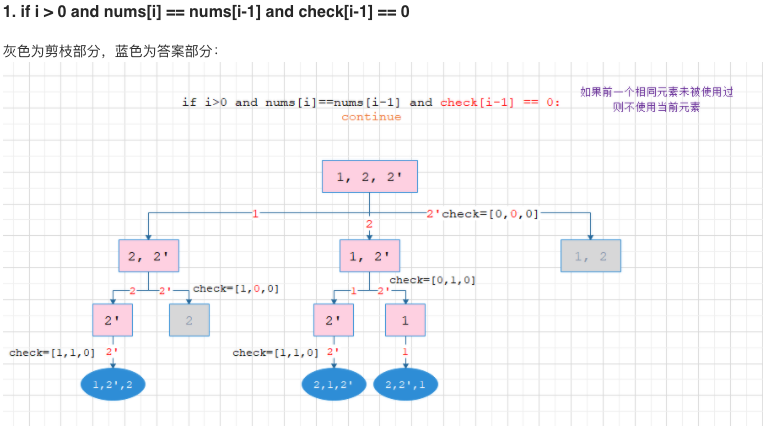
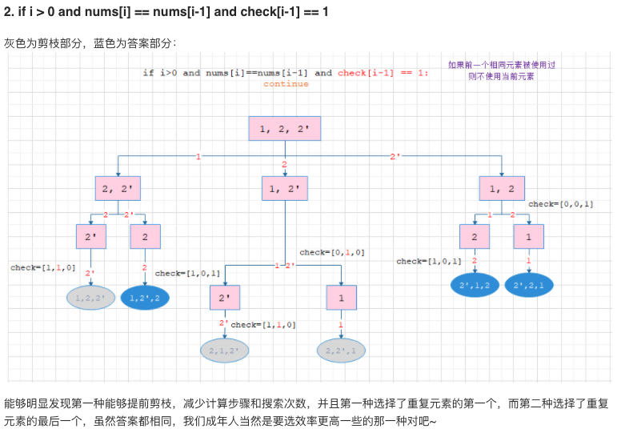

### 47. Permutations II

模版：

```java
class Solution {
    public int totalNQueens(int n) {
      	corner case
        dfs
      	return result
    }
    private void dfs(int level, int n) {
        base case 
        for 选择 in 选择列表：
          	choose
          	dfs（explore）
          	unchoose
        } 
    }
}
```

Ref: https://leetcode-cn.com/problems/permutations/solution/hui-su-suan-fa-python-dai-ma-java-dai-ma-by-liweiw/

**两个剪枝条件**
在permutation的**剪枝条件1**：用过的元素不能再使用之外，又添加了一个新的剪枝条件，也就是我们考虑重复部分思考的结果。

**剪枝条件2**：当当前元素和前一个元素值相同（此处隐含这个元素的index>0），并且前一个元素还没有被使用过的时候，我们要剪枝



前一个元素没被使用过，说明之前其他路径，在相同位置已经搜索过这个相同数字了，所以剪枝。

sub和visited记录的是从上到下一条路径上的状态。



前一个元素被使用过，说明之后还会轮到当前元素放在前一层，就先把这条路径剪枝

